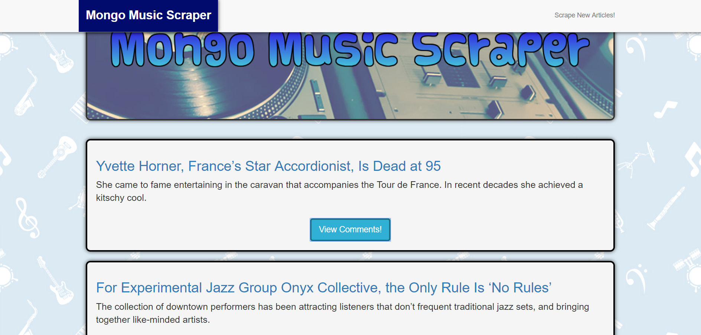

# MongoDB/Mongoose "Mongo Music Scraper" App

[View Live!](https://dry-sierra-51259.herokuapp.com/)

## Brief Description

The **MongoDB/Mongoose "Mongo Music Scraper" App** uses **MongoDB** and the ORM **Mongoose**, as well as the packages **Cheerio** & **Request** to scrape the *New York Times* Music website for articles and then store information about them in a database. The app then displays each article's information on the page and allows users to post & view comments about every article, which also get saved in the database. Comments can be deleted as well.

## How This Was Achieved  

I used **ExpressJS** to set up several routes. The first route **scrapes** the desired URL & saves information about the articles it finds into the Articles collection within the overall database. The database is targeted using special **Mongoose** syntax. The next route queries the Articles collection for every single document within it, and then sends the results of the query, as an object containing an array, to the **Handlebars** page that serves as the app's home page. This page runs through a loop of every article within the array and displays information about each article on the page.

The next route queries for a specific article by ID & populates it with its comments. This is activated when the user clicks the "View Comments" button on an article. A GET request is sent from the Front-End to the server with the ID of the article. Once an article is found that matches that ID, the article is populated with its associated comments & then each comment is rendered onto a Comments modal that pops up on the page

The next route handles the posting of a new comment. When the user types information into the comments form and clicks the post button, a POST request is sent to the server with the information that the user entered. Once it hits the server, a new Comment document is created within the Comments collection, and that comment is also pushed into the "comment" array within the article that it's associated with. 

The final route handles comment deletion. When the little blue "X" button next to a comment is clicked, it sends a GET request to the server with that particular comment's ID. The server then queries the DB to remove that comment from the Comments collection, and the comment also disappears from the Comments modal.

The schema of the database is set up using Mongoose models that define the structure of the Articles collection & the Comments collection. 

Users can click the "Scrape New Articles" button in the top right corner of the app to look for any new articles that may have been posted on the New York Times Music website and the information for these articles will be added to the page. 